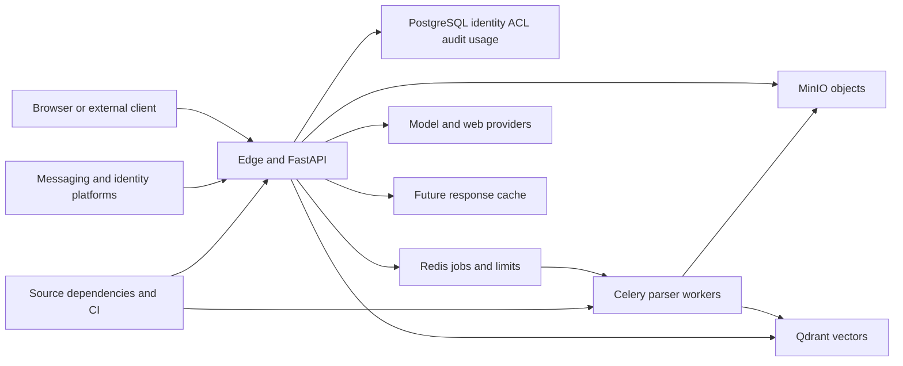

## Executive summary

Ragz's main trust boundaries are tenant-authenticated API access, document/attachment content entering workers and browsers, PostgreSQL authorization projected into Qdrant, provider/tool egress, and derived answers retained in histories/caches. The present priority is active upload preview, attachment resource admission, independent permission grants and authorization/freshness consistency. PR #11 adds cache-cancellation and grounding/accounting risks. This model accompanies the [2026-09-06 audit](2026-09-06-end-to-end-security-audit.md); it is provisional with respect to unconfirmed deployment/audience assumptions, not a second independently validated production assessment.

## Scope and assumptions

- Source: local `90bb3b1` plus ongoing CAG work, upstream main `9d08839`, PR #11 `3fac9fb`. Finding/version distinctions are in the application report.
- Assumed use: private organizational documents, multiple organizations on shared infrastructure, ordinary contributors uploading content, production app behind a TLS edge. This follows `docs/prd.md:14` and the declared security rules in `CLAUDE.md`.
- Operator manages TLS, network egress, identity-provider registration, messaging-platform audiences, credentials and backups. Those actual configurations were not supplied.
- CAG response replay is not yet wired into chat. Query-vector/expansion caches in the PR are different mechanisms.
- Source/security-scope clarification was requested; no response had been received at report preparation. Severity is conditional where deployment exposure changes it.

Open questions: Is the application public or restricted to a trusted network? Can ordinary tenants upload? Do bots expose private corpora to arbitrary platform users? Must document revocation also hide historical answers? Can API/workers reach sensitive overlay-network services? What proxy and production revision are deployed?

## System model

### Primary components

React/Vite browser UI; FastAPI API; PostgreSQL users/tenants/ACLs/chat/audit/usage state; MinIO document and attachment objects; Celery workers with Redis queues; Qdrant document and ephemeral vectors; LiteLLM/embedding/rerank providers; optional web fetch/search, OIDC, SMTP and Telegram/Slack/Discord integrations. Upstream outbox/reconciliation owns durable document job dispatch. The unfinished response-cache adapter uses a separate Redis instance.

Evidence: `api/app.py:create_app`, `worker/celery_app.py`, `worker/outbox.py`, `core/storage.py`, `modules/retrieval/service.py`, `modules/chat/llm.py`, `modules/bots/platforms.py`, `modules/auth/oidc.py`, `deploy/compose.prod.yaml`. Local response cache: `modules/cache/response.py`.

### Data flows and trust boundaries

- Browser → API: passwords, access/refresh credentials, file bytes, questions and resource IDs over HTTP behind assumed TLS. JWT/current-user checks, declarative permissions, schema validation, body limits and selected rate limits. Upload MIME remains client-controlled; attachment aggregate admission is missing.
- API → PostgreSQL: tenant queries, role/ACL changes, chat/audit/usage records over database protocol on internal network. ORM parameterization, per-object tenant checks, upstream composite constraints and append-only audit enforcement. Some audit/usage transactions are separated from the operations they represent.
- API → MinIO / Redis / worker: untrusted upload bytes, object keys and job identifiers over internal service protocols. User/workspace checks precede accepted upload; upstream document outbox improves durability. Attachment deletion loses external identifiers on DB cascade.
- Worker → parser/provider/Qdrant: untrusted document bytes become extracted text, embeddings and vectors. Generated paths and library calls avoid a demonstrated shell/path-traversal sink; parsers run with worker privileges and require resource isolation. Vector payloads carry tenant/workspace/ACL/version information.
- PostgreSQL authorization → Qdrant retrieval: committed security state is projected asynchronously. Upstream pending/failed exclusion and post-query recheck reduce stale ACL exposure; old local code lacks those controls. Completed revision races still need targeted validation.
- Retrieved documents/web results → LLM → browser: untrusted source text, generated answers/citations/UI blocks. Data delimiters, bounded tools, output/source validation, safe markdown and structured components; the separate original-file iframe bypasses those rendering protections.
- API → web/media: public search-result URLs and images through DNS/address checks, pinned public HTTP connections and bounded redirects/body reads. Shared-address classification differs from the admin egress guard.
- Platform/IdP → API: signed webhooks or OIDC callbacks. Webhook signature/replay controls and OIDC PKCE/state/nonce/claims validation exist. Bot platform delivery identity is distinct from end-user Ragz identity.
- Developer/PR → CI → deployed image: source and locked dependencies executed during build/test. GitHub workflows and scanners are security controls; Python scanner environment targeting is wrong, build dependencies are excluded by the frontend prod-only audit, some image tags remain mutable.
- Future API ↔ response cache: private answers and provenance under principal/version keys. Redis atomic matching cannot replace live authorization and authoritative PostgreSQL revision management.

#### Diagram

## Assets and security objectives

| Asset | Why it matters | Security objective |
|---|---|---|
| Original documents, chunks, private answers | Customer intellectual property and confidential data | C/I |
| Identities, roles, memberships, ACL revisions | Define who can access each asset | C/I |
| Password hashes, refresh/API/provider keys, KEK | Account and provider access | C/I |
| Histories, cached answers, source manifests | Persist sensitive derived content; govern reuse correctness | C/I |
| Workers, memory, storage, queues, provider budget | Shared availability and operating cost | A/I |
| Audit events and usage ledger | Detection, accountability and cost enforcement | I/A |
| Lockfiles, build inputs and runtime images | Supply executable code to every trust zone | I |

## Attacker model

### Capabilities

An unauthenticated caller can reach public auth/webhook/media entry points if deployed publicly. A contributor can submit documents, attachments and questions within granted workspaces. A malicious org admin can invoke allowed organization-management APIs. Attackers can control a public page returned by search or linked by a result. A platform user can send messages where platform configuration allows it. A contributor to the public repository can propose build inputs, subject to workflow approval.

### Non-capabilities

Do not assume a tenant can alter PostgreSQL rows, Redis keys, the KEK, provider configuration, network routes or deployment environment. Do not equate a guessed UUID with permission. Public bot endpoint signatures cannot be forged merely by knowing the URL. The model's text is not executable server code by default. A vulnerable dependency does not establish reachability of its vulnerable API from tenant uploads.

## Entry points and attack surfaces

| Surface | How reached | Trust boundary | Notes | Evidence |
|---|---|---|---|---|
| Auth/register/reset/refresh/SSO | Browser/public auth routes | Anonymous → identity | Current-user/rotation controls; deny telemetry defect | `api/routes/auth.py`, `api/routes/oidc.py`, `modules/auth/service.py` |
| User/group/template management | Privileged API | Admin → grant authority | Sensitive self-assignment gap | `api/routes/users.py`, `modules/tenancy/service.py:assign_custom_role` |
| Document upload/file preview | Contributor → reader | Stored bytes → worker/browser | Active-content preview risk | `api/routes/documents.py`, `frontend/.../document-viewer-drawer.tsx` |
| Chat attachments | Authenticated upload | Tenant → shared storage/worker | Aggregate admission and cleanup gaps | `api/routes/chats.py:upload_attachment`, `modules/chat/attachments.py` |
| Search/chat/retrieval | API or bot | Identity/ACL → vector content | Single filter; projection and history boundaries | `modules/retrieval/service.py`, `modules/chat/service.py` |
| External API keys/bots | API key or signed platform delivery | External caller → narrowed principal | Live membership checked; bot audience conditional | `api/routes/external.py`, `api/bots_relay.py` |
| Web/media fetch | Search results/signed image refs | Untrusted URL → server network | Address-range mismatch | `modules/chat/media.py`, `modules/chat/web_content.py` |
| Evals/MQR comparison | `evals.run` | User → paid compute | Override/control and accounting considerations | `api/routes/evals.py`, `modules/evals/comparison.py` |
| Error/audit reporting | Requests and failures | Runtime → monitoring | Denial classification and transaction gaps | `core/logging.py`, `modules/audit/service.py` |
| Dependency/CI/image inputs | PR/build/deploy | Untrusted inputs → executable artifact | Wrong scan target and known advisories | `.github/workflows/audit.yml`, lockfiles, Dockerfiles |

## Top abuse paths

1. Uploader stores active HTML → another user opens its blob preview → same-origin browser execution threatens that user's session (SEC-001).
2. Contributor repeatedly uploads attachments → no aggregate reservation limits the queue/storage → worker and shared-resource pressure; deleting chats removes cleanup records (SEC-002/006).
3. Org admin enumerates active templates → assigns sensitive template to self → newly built context supplies independent audit/content permissions (SEC-003).
4. Attacker-controlled public result redirects to shared address space → media policy accepts the destination → reachable internal text may enter the answer (SEC-004; network conditional).
5. Session A fails refresh → SPA retains query cache → B logs in in the same SPA → A's cached data can remain observable (SEC-005).
6. Cache owner is cancelled after computation before publication → unresolved in-flight entry persists → later identical requests wait indefinitely (PR-001).
7. Paid provider work completes → later source/alternative/stream operation fails or is cancelled → usage transaction never becomes durable (SEC-012, PR-002/003).
8. CI scans its own tool dependencies → application's vulnerable dependency is omitted → vulnerable runtime package ships under false audit assurance (SEC-010/011).

## Threat model table

| Threat ID | Threat source | Prerequisites | Threat action | Impact | Impacted assets | Existing controls (evidence) | Gaps | Recommended mitigations | Detection ideas | Likelihood | Impact severity | Priority |
|---|---|---|---|---|---|---|---|---|---|---|---|---|
| TM-001 | Malicious uploader | Upload permission; victim opens preview | Active file executes in viewer origin | Session/data compromise | Identity, documents | File ACL check; safe markdown (`documents.py`, markdown renderer) | Unsandboxed original-file iframe | Narrow validated previews; isolated/sandboxed rendering | Blocked-type counts; browser CSP telemetry | High: normal shared-document workflow | High: victim privilege determines reach | high |
| TM-002 | Contributor | Attachment permission | Repeated upload/parse and upload/delete cycles | Shared exhaustion and retained data | Compute, storage, queues | Per-file limit; Celery time bounds | No aggregate admission; cascade loses cleanup IDs | Atomic reservations and durable deletion jobs | Per-tenant bytes/jobs; age/size of orphan candidates | High where uploads enabled | High: common worker/store resources | high |
| TM-003 | Org admin | Active sensitive role template | Self-assign restricted grant | Separation-of-duties failure | ACL/audit controls | Same-org and active-template checks | No independent grant authority | Sensitive-grant authorization and self-grant restrictions | Actor equals target on privileged grants | Medium: already privileged actor | Medium: org-scoped escalation | medium |
| TM-004 | Public-page owner | Search result chosen; reachable overlay HTTP service | Redirect to accepted shared-space IP | Internal data retrieval | Network/private data | DNS pinning; RFC1918/metadata rejection | Missing CGNAT/non-global classification | Central egress classification/allowlist | Egress blocks; private-destination telemetry | Low to medium, deployment-dependent | High if sensitive service reachable | medium |
| TM-005 | Subsequent browser user | Same SPA lifetime after A auth failure | Observe retained query data under B | Cross-identity local disclosure | Private browser data | Explicit logout clears query cache | Passive failure/login transition does not | Central teardown plus in-flight cancellation | Identity-change tests and cache namespaces | Medium on shared devices | Medium: prior cached data only | medium |
| TM-006 | Request cancellation/concurrency | PR caches enabled, lock contention | Strand publication owner | Same-key request hangs | API availability | TTL/LRU for completed entries | No store-phase cancellation cleanup | Total lifecycle finalization and retry ownership | In-flight age, wait timeout, orphan-slot metrics | Medium: realistic cancellation edge | Medium: key/process scoped | medium |
| TM-007 | Tenant or ordinary failure | Paid action then cancellation/failure | Prevent durable usage/audit completion | Under-accounting, weak detection | Ledger, budgets, audit | Some commits; provider budgets | Multiple transaction gaps and mislabeled denials | Idempotent durable event boundaries; explicit results | Provider-to-ledger reconciliation | Medium: common failures | Medium: bounded by other controls | medium |
| TM-008 | Supply-chain/build input | Vulnerable API or malicious build/model input reached | Exploit unpatched component | Artifact/worker compromise | Runtime, build artifacts | Locked dependencies; CI checks | Wrong Python audit target; dev tree omitted | Explicit inventory audits, compatible updates, image scanning | SBOM and gate inventory assertions | Low to medium; reachability unresolved | High if vulnerable write path invoked | medium |

## Criticality calibration

Critical would require demonstrated pre-auth platform-wide compromise or extraction of the KEK/provider credentials across organizations; neither was established. High covers a contributor compromising an administrator's browser and a tenant exhausting shared worker/store capacity. Medium includes org-scoped independent-grant bypass, cache-key hangs, conditional internal egress and lost usage records. Low includes contradictory but still recognizable failure telemetry, non-executable URL scheme inconsistencies, and documentation discrepancies without a boundary bypass.

The most influential assumptions are untrusted uploads, the victim's privilege, bot audience restrictions, private network reachability, active cache configuration and whether revocation applies to historical answers. Model-only prompt injection does not by itself imply crossing an ACL or executing a tool outside the implemented allowlist.

## Focus paths for security review

| Path | Why it matters | Related threats |
|---|---|---|
| `frontend/src/features/documents/document-viewer-drawer.tsx` | Untrusted original-file rendering | TM-001 |
| `backend/src/ragz/api/routes/documents.py` | Type handling, file serving, admission | TM-001/002 |
| `backend/src/ragz/modules/chat/attachments.py` | Storage, parsing, TTL lifecycle | TM-002 |
| `backend/src/ragz/modules/chat/chats.py` | Chat cascade/deletion cleanup | TM-002 |
| `backend/src/ragz/modules/tenancy/context.py` and `service.py` | Effective permissions and grants | TM-003 |
| `backend/src/ragz/modules/chat/media.py` and `web_content.py` | Public-content egress and address policy | TM-004 |
| `frontend/src/api/client.ts` and auth mutations | Identity transitions and cached data | TM-005 |
| `backend/src/ragz/modules/retrieval/embeddings.py` and `query_expansion.py` | In-flight cache lifecycle | TM-006 |
| `backend/src/ragz/modules/retrieval/service.py` | Projection snapshots, grounding and usage | TM-006/007 |
| `backend/src/ragz/modules/evals/comparison.py` | Paid retrieval/source/commit boundary | TM-007 |
| `backend/src/ragz/modules/auth/api_keys_service.py` and `modules/audit/service.py` | Credential/audit atomicity and result semantics | TM-007 |
| `.github/workflows/audit.yml` and dependency lockfiles | Accurate dependency coverage | TM-008 |
| `backend/src/ragz/modules/cache/response.py` | Future derived-content freshness/authorization | Future cache boundary |

## Quality and residual uncertainty

Entry-point families and each modeled runtime/CI boundary are represented above. Production controls are distinguished from development/test configuration. Ordinary authentication/tenant isolation was exercised by the retained 223-test focused run; synthetic evidence tests establish specific defects. Actual deployment/edge/bot configuration, full browser execution, parser fuzzing, container scanning and the completed-revision race remain outside verified runtime coverage. Recommendations are therefore grounded in source and stated assumptions, with no claim of complete production exploitation coverage.
